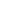

# Introduction
The **SceneMap Plugin** for Godot 4.x provides a visual and interactive way to manage and navigate complex scene hierarchies. It allows developers to represent scenes as graph nodes, with connections (slots) and components that synchronize automatically with the underlying Godot scene structure.

### Key features:
- **Graph-based visualization:** See your scene structure as an editable graph.

- **Automatic synchronization:** Nodes, components, and slots stay consistent across updates.

- **Preview system:** Quickly visualize individual components or entire scenes.

- **Modular and extensible:** Easily add new node types or customize behavior for specific projects.

The plugin is designed to help you **organize, navigate, and manage scenes** efficiently, while keeping everything synchronized between the editor and runtime representation.

# Quick guide

**[1. Create SceneMapComponents:](#how-to-prepare-a-scenemapcomponent)**
- Inherit from `SceneMapComponent2D` or `SceneMapComponent3D`.
- Override `go_to_next_scene()` to define how the player moves between scenes.

**[2. Set up a Scene Controller (example):](#how-to-prepare-a-scene-controller-example)**
- Extend `Node2D` (or your preferred node).
- Assign a `default_spawn_node` and a reference to the player.
- Move the player to the spawn point in `_ready()` using `get_component_position()`.

**[3. Integrate Components into a Scene:](#how-to-integrate-everything-into-a-scene)**
- Attach your scene controller to the root node.
- Add SceneMapComponents at every entry and exit point.
- Assign the default spawn component in the controller.

**[4. Use Sub-Components (optional):](#sub-components)**
- `SceneMapComponentArea2D` triggers scene transitions automatically when a body or area enters.
- `SceneMapComponentMarker2D` adds an editor-only visual marker and allows minor adjustments to the spawn position.

**[5. Add scenes to the Graph:](#adding-scenes-to-the-Map)**
- Make sure the SceneMap Plugin is active and open the **SceneMap** tab.
- Add scenes using the Add button or drag `.tscn` files.
- Connect scenes using arrow slots and manage slot settings (disconnect, side, type, name).
- Refresh the graph or delete nodes as needed.

**[6. Set Node Types:](#node-types)**
- Choose between `Entry`, `Exit`, `Two-Way`, or `Funnel` for each scene node to define its behavior and allowed transitions.

# Instructions

## How to prepare a SceneMapComponent
A **SceneMapComponent** represents an entry or exit point (or both) of a scene within the SceneMap Plugin. Any class that inherits from **SceneMapComponent2D** or **SceneMapComponent3D** is automatically recognized by the plugin as a scene connection point.

### Steps to Create a SceneMapComponent

1. **Create a new class that inherits from** `SceneMapComponent2D`. Decorate it with the `@tool` annotation.

1. **Override the** `go_to_next_scene()` **method**. This method defines how the player is transported from the current component to the next scene.

1. **Obtain the next scene instance** using `get_next_scene_instance()`.

1. **Get the next component reference** within that scene using `get_next_component_reference(next_scene)` and **assign it to the next scene**<sup>**1**</sup>.

1. **Load the next scene into the scene tree** using `load_scene_into_tree(next_scene)`.

><sup>**1**</sup> Setting a next component is only part of this example. In a real implementation, the next scene can handle the player’s spawn position however you like—e.g., using hardcoded coordinates, calculating it dynamically, or using other logic.

### Code example
```gdscript
@tool
extends SceneMapComponent2D

func go_to_next_scene():
	var next_scene = get_next_scene_instance()
	var next_component = get_next_component_reference(next_scene)
	next_scene.where_to_spawn = next_component
	load_scene_into_tree(next_scene)
```

## How to Prepare a Scene Controller (Example)

Managing a scene controller is 100% the developer's responsibility. This example shows a minimal implementation to illustrate how **SceneMapComponents** can be used as player spawn points. You can adapt this however you like in your project.

### Steps to Implement a Minimal Scene Controller

1. **Create a new class** that extends `Node2D` (or your preferred node type).

1. **Export a default spawn component** to be used if no specific spawn is assigned.

1. **Store a reference to the player node** using `@onready`.

1. **Move the player to the spawn point** in `_ready()`, using the `get_component_position()`<sup>**2**</sup> method on either the assigned `where_to_spawn` or the `default_spawn_node` properties.
><sup>**2**</sup> It is very important to use the `get_component_position()` method instead of just using the `global_position` property from the component.

### Code example
```gdscript
extends Node2D

@export var default_spawn_node: SceneMapComponent2D

@onready var player: Player = $Player

var where_to_spawn: SceneMapComponent2D

func _ready() -> void:
	if not where_to_spawn:
		player.global_position = default_spawn_node.get_component_position()
	else:
		player.global_position = where_to_spawn.get_component_position()
```

## How to Integrate Everything Into a Scene
The setup of a scene controller and components is fully controlled by the developer. This example shows a minimal integration to illustrate how **SceneMapComponents** and a scene controller can work together.

### Steps to Integrate a Scene

**1. Add a Scene Controller to the root node**

- Attach your scene controller script (e.g., `MySceneController.gd`) to the root node of the scene.

- This will handle spawning the player using the components.

**2. Add SceneMapComponents for each entry and exit**

- Place a component (e.g., `MySceneMapComponent.gd`) at every point where the player can enter or exit the scene.

- These components will be recognized by the plugin as scene connection points.

**3. Assign the default spawn component in the controller**

- Set the `default_spawn_node` property in your scene controller to a component that will be used if no specific `where_to_spawn` is assigned.

### Example setup
```
RootNode (MySceneController script attached)
├─ Player (node referenced by controller)
└─ EntryComponent (MySceneMapComponent script attached)
```

## Sub-Components
Sub-components extend the functionality of regular SceneMapComponents. Currently, there are two available sub-components:

**- SceneMapComponentArea2D:** An `Area2D` that triggers the `go_to_next_scene()` method of its parent component when a body or area enters it.

**- SceneMapComponentMarker2D:** Adds a visual marker (editor-only) and can override the return value of the `get_component_position()`<sup>**3**</sup> method, allowing small adjustments to the player’s spawn point.

><sup>**3**</sup> Always use `get_component_position()` to get the component's position point instead of `global_position`, since the marker may offset the actual position.

## Adding Scenes to the Map
Before using the graph, make sure the SceneMap Plugin is activated. To do this, go to **Project > Project Settings > Plugins**, find **SceneMap Plugin** in the list, and set its status to Active. Then, **open the SceneMap tab** in the editor to access the graph interface.

The graph provides a visual overview of your scenes and their connections. You can add, connect, and manage scenes directly from the graph using the available buttons and slots.

### Using the graph

1. Use the  button or drag a `.tscn` file into the map to add a new scene.  
2. Drag and drop the arrow slots  to connect one scene to another.  
3. Use the controls in each slot to:  
   - Disconnect them   
   - Change their side   
   - Change their type   
   - Edit their name   
4. Use the  button to refresh all nodes in the map.  
5. Press `DEL` while one or more nodes are selected to remove them from the map.

## Node types
In the **SceneMap graph**, each scene node can have one of four types, which determine how it behaves and how connections are handled:

1. **Entry:** Marks the node as an entry point. Components in this scene can be used as spawn points when the player enters from another scene.

2. **Exit:** Marks the node as an exit point. Components in this scene can trigger transitions to other scenes.

3. **Two-Way:** Combines both entry and exit behaviors. The scene can act as both an entry and an exit, allowing the player to arrive from another scene and leave to another scene from the same node. This will be the most typical use-case.

4. **Funnel:** The node acts as both an entry and an exit, but in a fixed direction. The player enters from one side and leaves through another, typical for level progression where the player never goes back. 

# Credits & License
The **SceneMap Plugin** has been developed entirely by Guillem Chesa.

By purchasing this plugin, you are granted permission to use and modify it freely in as many personal or commercial projects as you like.  

**Restrictions:**  
- You **may not sell** modified versions of the plugin.  
- If the plugin is used in larger teams or for commercial projects, consider giving a tip or supporting the author as a way of saying thanks.

Thank you for respecting the license and supporting continued development!
